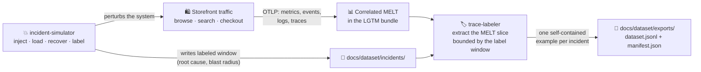
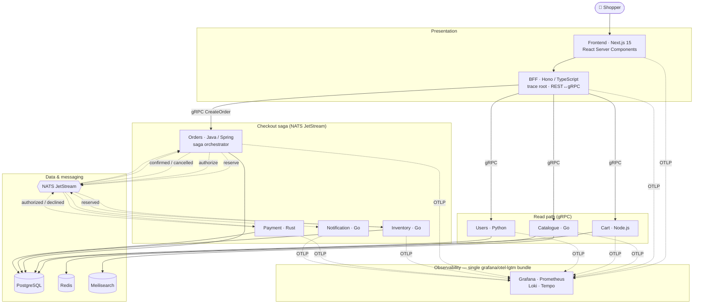

<div align="center">

# 👟 Shoe Shop

### A real, polyglot e-commerce platform that turns its own failures into a trainable observability dataset.

Six languages. Nine services. One correlated trace from the click to the confirmation —
and a library of reproducible incidents that export themselves into machine-readable training data.

[](LICENSE)
[](https://github.com/Shoe-Shop/Shoe-Shop/releases)
[](#-the-services)
[](https://opentelemetry.io/)
[](#-the-four-signal-melt-standard)
[](#-quick-start)

</div>

<!--
  ⤵ ADD A DEMO HERE before sharing this repo publicly.
  A single looping GIF (storefront checkout on the left, the resulting correlated
  trace in Grafana on the right) is the highest-leverage thing you can add — it is
  what makes a visitor scroll instead of bounce. Drop it at docs/media/demo.gif and
  uncomment:
  <p align="center"></p>
-->

---

## What this is

**Shoe Shop is a complete, runnable online shoe store — browse, search, cart, checkout — built the way a real production system is built, and then instrumented so deeply that every request is fully observable across all nine services.**

It is *polyglot on purpose*: the request path crosses TypeScript, Go, Node.js, Python, Java, and Rust, so distributed tracing has something genuinely hard to correlate — and you get an idiomatic, working OpenTelemetry reference in every one of those languages.

But the storefront is the vehicle, not the destination. Shoe Shop's real output is **data**:

1. It emits **four correlated telemetry signals** — **M**etrics, **E**vents, **L**ogs, **T**races (**MELT**) — that all tie back to the same request.
2. It can **break itself on demand**, through a library of labeled, reproducible failure scenarios with known root causes.
3. It **exports** the telemetry from each failure into a **versioned, provenance-tracked dataset** — one self-contained training example per incident.

The result is something most sample applications can't give you: a steady, honest supply of *correlated four-signal telemetry around known, reproducible failures.*

---

## The problems it solves

Operating distributed systems is a skill, and skills need a realistic place to practise. The usual sample apps don't provide one:

| The problem | How Shoe Shop addresses it |
|---|---|
| **Sample apps emit shallow, disconnected telemetry** you can't actually debug with. | Every service ships **four signals that are verified to correlate** — click a slow trace, jump to its logs, its metrics, its events, all by the same `trace_id`. |
| **Real incidents are rare and scary to practise on.** | A catalogue of **reproducible, labeled incidents** — known root cause, real blast radius, observable symptom chain — that you replay on a laptop with one command. |
| **AIOps / observability research needs realistic labeled telemetry, and it's hard to get.** | A **git-committed JSONL corpus**: each labeled incident exported as one example (input = the four signals; label = root cause / remediation / fault), with sha256 provenance. |
| **Idiomatic OpenTelemetry per language is scattered across blog posts.** | **One repo, six languages**, each instrumented to the same explicit standard — a working reference you can copy. |

**Who it's for:** engineers practising distributed tracing and signal correlation; educators who need a realistic system that stands up in minutes; tool authors and researchers who want an honest, correlated telemetry source to build and benchmark against; and anyone learning to read a whole distributed system through a single pane of glass.

---

## How it works — the product loop

The whole project is one closed loop. The store generates telemetry; a fault is injected and labeled; the labeled window is exported into the dataset.



This loop is **complete and verified end-to-end today.**

---

## Architecture

A shopper's request fans out over **gRPC** for synchronous reads and an **orchestrated saga over NATS JetStream** for checkout. Every hop propagates the W3C `traceparent` — including across the async NATS messages — so the entire checkout, from the browser click to the confirmation notice, is **one correlated trace.**



**Checkout saga (`reserve → authorize → confirm`, with compensation):** Orders is the orchestrator — a sync gRPC front door (`CreateOrder` / `GetOrder`), then an async state machine over NATS. Inventory reserves stock; Payment is a deterministic authorize/decline simulator; on success Orders confirms and Notification fans out a notice; on failure the saga compensates (releases the reservation) and cancels. A forced payment decline drives the whole flow to `CANCELLED` — visible as one trace.

> Depth lives in **[`ARCHITECTURE.md`](ARCHITECTURE.md)** (the engineering ground truth) and the decision records in **[`docs/adr/`](docs/adr/)**.

---

## The services

Each service was picked for the language that fits its workload — and each is instrumented to the same four-signal standard.

| Service | Language / Framework | Transport | Datastore | Role |
|---|---|---|---|---|
| **Frontend** | TypeScript · Next.js 15 (App Router, React 19) | HTTP | — | The NEXUS storefront: home · shop · product · cart · checkout · account |
| **BFF** | TypeScript · Hono | REST ↔ gRPC | — | Aggregation + trace root for browser traffic |
| **Catalogue** | Go · gRPC + `sqlc` | gRPC | PostgreSQL + Meilisearch | Read-heavy product catalogue & search |
| **Cart** | Node.js · gRPC | gRPC | Redis | Mutation-heavy, session-affine cart |
| **Users** | Python · FastAPI + gRPC | gRPC | PostgreSQL | Shopper profiles / accounts |
| **Orders** | Java 21 · Spring Boot | gRPC + NATS | PostgreSQL | Checkout-saga orchestrator |
| **Inventory** | Go · gRPC + NATS | gRPC + NATS | PostgreSQL | Stock reads + saga reserve/release |
| **Payment** | Rust · Axum + NATS | NATS only | PostgreSQL | Deterministic authorize/decline simulator |
| **Notification** | Go · NATS subscriber | NATS only | — | Pure fan-out on terminal order events |

**Languages:** TypeScript, Go, Node.js, Python, Java, Rust — enough to make cross-language tracing genuinely interesting, few enough that one person can reason about the whole repo.

**Status:** these **9 services are real and four-signal complete** (verified correlated live in Grafana). Two further services (shipping, recommendation) and full OIDC auth are stubbed placeholders, parked on the roadmap below.

---

## The four-signal (MELT) standard

A service is not considered "done" here until **all four signals are emitted *and verified to correlate*** — not traces alone. That bar is the project's core discipline.

- **Metrics** — RED (rate / errors / duration) per service, with trace **exemplars** where the SDK supports them.
- **Events** — structured domain events (`payment.declined`, `orders.confirmed`, `notification.sent`) carrying the saga `trace_id`.
- **Logs** — structured, every line stamped with `trace_id` / `span_id`.
- **Traces** — one span tree per request, propagated across both gRPC **and** NATS messages.

The full Definition of Done, the per-language instrumentation notes, and the per-stack exemplar policy are in [`ARCHITECTURE.md` §9](ARCHITECTURE.md).

---

## The incident corpus

Failures here are **never random pod-killing.** The simulator runs one labeled scenario end-to-end — `manifest → inject → load → recover → label` — against the live checkout stack, writes a schema-v0 record (real `time_window`, root cause, affected services, order ids) to [`docs/dataset/incidents/`](docs/dataset/incidents/), and posts a Grafana region annotation for the window.

Five scenarios ship today, each **verified correlated against live telemetry**, across all four Compose-native injection methods:

| Scenario | Method | Fault → observable symptom |
|---|---|---|
| `payment-hard-decline` | env-knob | every authorization refused → all orders `CANCELLED` via saga compensation |
| `payment-latency-spike` | env-knob | slow authorizations (~1.5 s) → orders still `CONFIRM`, latency visible |
| `notification-down` | compose-stop | orders `CONFIRM` but no `notification.sent`; durable consumer drains the backlog on recovery |
| `catalogue-db-throttle` | resource-limit | Postgres throttled under browse load → catalogue p99 ≈ 10× baseline, no crash |
| `checkout-load-spike` | load | concurrent browse/search burst → read-path latency climbs, system stays up |

```bash
task chaos:list                          # see available scenarios
task chaos:run -- payment-hard-decline   # inject, load, recover, label (needs the checkout stack up)
```

---

## The dataset

`trace-labeler` closes the loop: for each labeled incident it extracts the correlated four-signal slice bounded by the record's `time_window` from the running observability bundle, and writes **one self-contained JSONL line per incident** to [`docs/dataset/exports/`](docs/dataset/exports/) — `dataset.jsonl` plus a sha256-provenanced `manifest.json`.

```bash
task dataset:export                 # export every labeled incident
task dataset:export -- incident-0002
```

**The current corpus** ([`manifest.json`](docs/dataset/exports/manifest.json)):

| Incidents | Traces | Spans | Logs | Events | Metric series | Exemplars |
|:--:|:--:|:--:|:--:|:--:|:--:|:--:|
| **5** | 68 | 946 | 2,201 | 1,598 | 32 | 20 |

Each example carries the input signals and the ground-truth label together:

```jsonc
{
  "incident_id": "incident-0002",
  "scenario_id": "payment-hard-decline",
  "label": {
    "root_cause": "Payment configured to decline 100% of authorizations; the saga ran compensation and moved every order to CANCELLED…",
    "remediation": "Cleared the decline knob and recreated Payment; durable fix: alert on a sustained decline-rate spike…",
    "fault": { "type": "payment-decline", "target_service": "payment", "injection_method": "env-knob" },
    "affected_services": ["payment", "orders", "inventory", "notification", "bff"]
  },
  "signals": {
    "traces":  [ /* full span trees across gRPC + NATS */ ],
    "logs":    [ /* trace_id-stamped, structured */ ],
    "events":  [ /* payment.declined, orders.cancelled, … */ ],
    "metrics": { "series": [ /* RED histograms */ ], "exemplars": [ /* metric↔trace links */ ] }
  },
  "evidence": { "symptoms": [ /* each label pointer executed live against the bundle */ ] }
}
```

Every symptom pointer in a label is **executed verbatim against the live telemetry at export time**, so the dataset doubles as its own validation: a label that doesn't resolve is a label that gets fixed.

---

## Quick start

**Prerequisites:** Docker Desktop (WSL2 backend on Windows) and the [`task`](https://taskfile.dev) CLI. Everything runs in containers — no language toolchains needed on your host.

```bash
git clone https://github.com/Shoe-Shop/Shoe-Shop.git
cd Shoe-Shop

task up:core      # creates .env, builds images, starts the storefront +
                  # the 5 read-path services + Grafana. First run builds; later runs are fast.
```

Then open:

| | URL |
|---|---|
| 🛍️ **Storefront** | http://localhost:9000 |
| 📊 **Grafana** (the single pane of glass) | http://localhost:3000 |

To run the full checkout saga (Orders + Inventory + Payment + Notification over NATS):

```bash
task up:checkout  # read path + the v0.3 write path
```

> **The RAM dial.** Shoe Shop is resource-first — it targets a 16 GB laptop with Docker capped at ~8 GB. `core` idles light (~0.9 GB); the JVM-heavy write path is the opt-in `checkout` overlay so daily dev stays lean.

Everyday commands:

```bash
task ps                 # container status
task logs -- catalogue  # tail one service
task down               # stop (keeps data volumes)
task --list             # all tasks
```

---

## Repository layout

```
Shoe-Shop/
├── ARCHITECTURE.md                # engineering ground truth (status, decisions, conventions)
├── CLAUDE.md                      # session bootstrap / short-form status
├── proto/                         # gRPC contracts (Buf) + generated stubs
│   ├── catalogue/ cart/ users/ inventory/ orders/   (Payment is NATS-only — no proto)
│   └── gen/
├── services/
│   ├── frontend/  bff/                              # presentation
│   ├── catalogue/ cart/ users/                      # read path
│   └── orders/ inventory/ payment/ notification/    # checkout saga
├── deploy/compose/                # base + core / checkout / full / lean-jvm / pyroscope overlays
├── tools/
│   ├── incident-simulator/        # labeled fault injection → docs/dataset/incidents/
│   └── trace-labeler/             # MELT export → docs/dataset/exports/
├── docs/
│   ├── adr/                       # Architecture Decision Records
│   └── dataset/                   # schema, incidents/, and the exported corpus
└── Taskfile.yml                   # one command interface for everything
```

---

## Roadmap

`v0.4` — **the product loop is complete and verified end-to-end:** storefront → correlated MELT → labeled incidents → trainable dataset.

- [x] **v0.1 — Foundations** · monorepo, Taskfile, Compose profiles with per-container memory limits, `proto/` + Buf.
- [x] **v0.2 — Read path + storefront** · Catalogue, BFF, Cart, Users **+ the Next.js 15 storefront**, all four-signal complete and verified correlated.
- [x] **v0.3 — Checkout saga** · Orders, Payment, Inventory, Notification over **NATS JetStream** — the whole checkout is **one correlated trace** across the async hops, with compensation. **9 services four-signal complete.**
- [x] **Incident framework** · the simulator: four Compose-native injection methods, five labeled reproducible scenarios verified live.
- [x] **The dataset** · `trace-labeler` exports the correlated MELT slice per labeled window into a versioned JSONL corpus.

**Next (optional breadth):**

- [ ] **Realism** · finish the two stub services (shipping, recommendation) and integrate full OIDC auth (a single demo identity today).
- [ ] **Corpus depth** · multi-fault / combined scenarios and SLO / error-budget framing for richer multi-signal correlation.
- [ ] **Observability depth** · dashboards-as-code, SLOs, and a separated cluster-grade telemetry topology.

> The labeled corpus exists to one day train an automated SRE assistant. That is the long-term *why*, parked for now — the platform and the dataset stand on their own.

---

## Contributing & license

Contributions are welcome. The model is light: **ADRs first** for architectural changes (`docs/adr/NNNN-title.md`), **Conventional Commits**, and **DCO sign-off** (`git commit -s`) on every PR — no CLA. See [`CONTRIBUTING.md`](CONTRIBUTING.md), [`CODE_OF_CONDUCT.md`](CODE_OF_CONDUCT.md), and [`SECURITY.md`](SECURITY.md).

Licensed under the **[Apache License 2.0](LICENSE)** — permissive and vendor-friendly, so engineers, educators, and tool authors can adopt Shoe Shop without friction.

<div align="center">

---

**Built for everyone learning to run distributed systems — so there's something real to learn on.**

</div>
