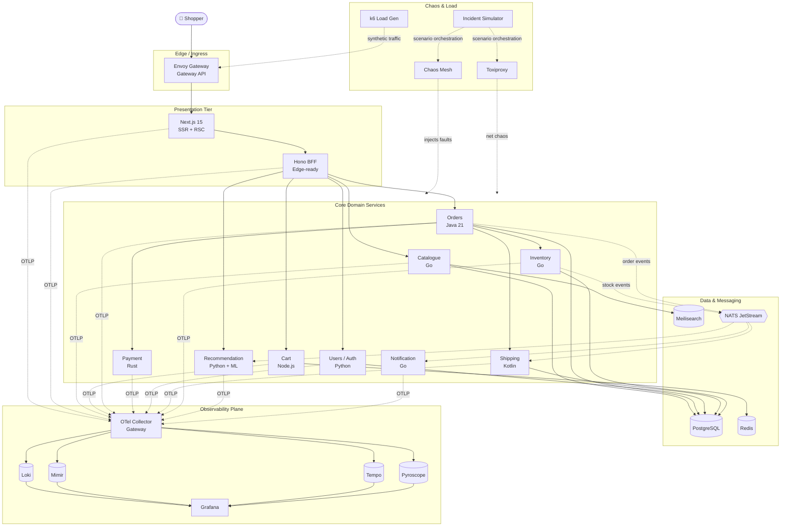
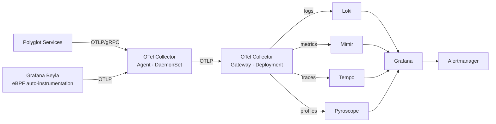

<div align="center">

# 👟 Shoe Shop

**A polyglot, cloud-native e-commerce platform — built as a hands-on playground for Observability, Chaos Engineering, and Reliability practice.**

*Six languages, one request path, telemetry-rich by default.*

[](LICENSE)
[](https://opentelemetry.io/)
[](https://www.cncf.io/)
[]()

</div>

---

## 📖 Table of Contents

1. [Why Shoe Shop?](#-why-shoe-shop)
2. [Project Vision](#-project-vision)
3. [High-Level Architecture](#-high-level-architecture)
4. [The Microservices Matrix](#-the-microservices-matrix)
5. [Data Plane: Sync, Async & Storage](#-data-plane-sync-async--storage)
6. [Observability Stack (LGTM+P)](#-observability-stack-lgtmp)
7. [Chaos & Incident Engineering](#-chaos--incident-engineering)
8. [UI/UX Approach](#-uiux-approach)
9. [Repository Layout](#-repository-layout)
10. [Local Development Promise](#-local-development-promise)
11. [Roadmap](#-roadmap)
12. [License & Contributing](#-license--contributing)

---

## 🎯 Why Shoe Shop?

Cloud-native systems in 2026 are **polyglot, distributed, and observable-by-design** — yet the skills to operate them are usually learned on trivial sample apps that emit shallow telemetry and never fail in interesting ways. Shoe Shop is the opposite: a complete, runnable, production-shaped platform built around the problems that actually make distributed systems hard.

It is an open-source e-commerce platform engineered as a **sandbox for modern operations**:

- **Polyglot orchestration** — six languages cooperating across a single request path, so distributed tracing has something real to correlate.
- **OpenTelemetry everywhere** — every service emits structured, correlated logs, metrics, traces, and profiles by default, following OTel semantic conventions.
- **Failure as a first-class feature** — built-in, repeatable incident scenarios with known root causes, not just ad-hoc fault injection.
- **Production-grade patterns** — Gateway API ingress, gRPC plus event-driven messaging, GitOps delivery, and signed multi-arch images.

Nothing here is a toy. The telemetry is rich enough to debug with, to benchmark tools against, and to genuinely learn from.

---

## 🚀 Project Vision

Shoe Shop has one goal: be the **e-commerce platform you learn real distributed-systems operations on.**

Most sample shops are toys — a single language, a shallow request path, telemetry you can't actually debug with, and code that never fails in interesting ways. Shoe Shop is the opposite. It's a complete, runnable storefront — browse, search, cart, checkout — built the way a real production system is built, then instrumented so deeply that you can *see* everything it does.

It's meant to be genuinely useful to anyone who wants to learn:

- **Engineers** practising distributed tracing, log / metric / trace / profile correlation, and reading a whole system through a single pane of glass.
- **Educators** who need a realistic, reproducible platform that stands up in minutes on a laptop.
- **Tool authors** who want a rich, honest telemetry source to build against and benchmark.
- **Operators-in-training** who want to live through real incidents — known root cause, real blast radius, observable symptoms — and practise diagnosing them under pressure.

The guiding principle: **if it happens in a real production system, it should be reproducible here** — and observable enough that you can understand *what* broke, *where* it broke, and *why*.

---

## 🏗 High-Level Architecture



**Request lifecycle (golden path):**

1. Shopper hits **Envoy Gateway** (Gateway API v1, HTTPRoute) which TLS-terminates and routes by host/path.
2. **Next.js 15** renders via React Server Components, hydrating from the **Hono BFF** which aggregates calls to downstream services. The BFF is the trace-root for user-initiated traffic.
3. Domain services communicate **synchronously via gRPC** (with REST shims at the edge) and **asynchronously via NATS JetStream** for event-driven flows (order placed → shipping reserved → notification sent).
4. Every hop propagates **W3C `traceparent`** and emits OTLP to a per-node **OpenTelemetry Collector agent**, which forwards to a **gateway-tier Collector** for processing, tail-sampling, and fanout to Loki / Mimir / Tempo / Pyroscope.
5. **Grafana** is the single pane of glass; dashboards, alerts, and SLOs are stored as code in this repo.

---

## 🧬 The Microservices Matrix

Polyglot is deliberate: it forces the observability layer to prove cross-language correlation, and it gives readers idiomatic instrumentation examples in the languages they actually work in. Each service was picked for the language that best fits its workload — not for variety's sake.

| # | Service | Language / Framework | Runtime | Datastore | Why this stack |
|---|---------|----------------------|---------|-----------|----------------|
| 1 | **Frontend** | TypeScript · Next.js 15 (App Router) | Node.js 22 / Edge | — | React Server Components and streaming SSR are the modern default; deep ecosystem; renders fast on cold caches. |
| 2 | **BFF** | TypeScript · Hono | Node.js 22 / Bun-compatible | — | Tiny, Web-Standard `fetch` API, edge-portable, excellent OTel support. Acts as trace root + auth boundary. |
| 3 | **Catalogue** | Go · gRPC + `sqlc` | Go 1.25 | PostgreSQL + Meilisearch | Read-heavy, low-latency. Go's GC pauses are negligible at this scale; `sqlc` keeps queries typesafe. |
| 4 | **Cart** | TypeScript · Fastify | Node.js 22 | Redis (primary store) | Session-affine, mutation-heavy, short-lived data. Redis is the right shape; Fastify is fast and OTel-native. |
| 5 | **Orders** | Java 21 · Spring Boot 3.3 (virtual threads) | JVM 21 | PostgreSQL | Classic enterprise workload — transactions, sagas, audit. Virtual threads remove the thread-per-request cost without rewriting the model. Also showcases JVM-side observability. |
| 6 | **Payment** | Rust · Axum + `sqlx` | Native | PostgreSQL | Security- and correctness-critical mock. Rust forces explicit error paths and gives us a `no_std`-adjacent footprint to demo low-resource scenarios. |
| 7 | **Users / Auth** | Python · FastAPI | Python 3.12 | PostgreSQL + **Zitadel** (OIDC) | FastAPI is the most idiomatic async Python web stack; auth is delegated to **Zitadel** — a Go-based OIDC provider (~200 MB) chosen over Keycloak's ~500 MB JVM for the local RAM budget — so we demo real SSO traces without the footprint. Pluggable behind standard OIDC; Keycloak remains a documented swap. |
| 8 | **Shipping** | Kotlin · Ktor (coroutines) | JVM 21 | PostgreSQL | Integration-style service (calls fake carrier APIs). Showcases the *other* major JVM language and structured concurrency. |
| 9 | **Inventory** | Go · gRPC-first | Go 1.25 | PostgreSQL | High-throughput stock reservations. gRPC streaming demonstrates non-HTTP tracing. |
| 10 | **Recommendation** | Python · FastAPI + ONNX Runtime | Python 3.12 | PostgreSQL (read-replica) | Realistic AI-inference workload — tail-latency heavy, GPU-optional. ML services have distinctive, tail-latency-driven failure modes worth observing. |
| 11 | **Notification** | Go · NATS subscriber | Go 1.25 | (stateless) | Fan-out worker — email/SMS/webhook mocks. Demonstrates async-only services in traces. |

### Languages summary
**6 languages**: TypeScript, Go, Java, Rust, Python, Kotlin. Enough to make cross-language tracing genuinely interesting; few enough that one engineer can reason about the whole repo.

### Deliberately *excluded*
- **.NET / C#** — not because it's a bad fit, but to keep the matrix lean. Easy community contribution later.
- **Microservices for everything** — no separate "email service" + "SMS service"; one Notification worker handles both. Resist over-decomposition.

---

## 🔌 Data Plane: Sync, Async & Storage

### Inter-service protocols

| Protocol | Where | Why |
|----------|-------|-----|
| **gRPC** (Protobuf) | Service ↔ service | Strong contracts, generated clients in every language, native streaming, OTel-instrumented out of the box. |
| **REST/JSON** | BFF ↔ Frontend, external webhooks | Browser-friendly, debuggable, no codegen friction on the edge. |
| **NATS JetStream** | Event-driven flows | Modern, lightweight (single binary), at-least-once with consumer ack, OTel propagation supported. Chosen for footprint and replayable streams; Redpanda is a documented drop-in for teams that want Kafka semantics. |

### Schema strategy
- **`/proto`** is the single source of truth for service contracts.
- Buf for linting, breaking-change detection, and codegen.
- **AsyncAPI 3** documents every NATS subject.

### Datastores

| Store | Used by | Why |
|-------|---------|-----|
| **PostgreSQL 16** | Catalogue, Orders, Payment, Users, Shipping, Inventory | One battle-tested OLTP store. Per-service schema or per-service database — not "shared DB" anti-pattern. |
| **Redis 7** | Cart, rate-limiting | Cart is genuinely K/V; Redis is the right tool. |
| **Meilisearch** | Catalogue search | Open-source, OTel-instrumentable, much simpler ops than Elasticsearch for this workload. Typesense is a drop-in alternative. |
| **NATS JetStream** | Event bus + KV for ephemeral state | See above. |

Every datastore runs in-cluster for hermetic local dev. No cloud SaaS dependencies are required to run the full stack.

---

## 🔭 Observability Stack (LGTM+P)

Every choice below is 100% free and open-source. No "free tier" lock-in.



### The pillars

| Signal | Tool | Why this and not the alternative |
|--------|------|-----------------------------------|
| **Logs** | **Grafana Loki** | Label-based indexing, cheap at rest, native Grafana integration. Trivial trace↔log correlation via `trace_id` label. |
| **Metrics** | **Grafana Mimir** (Prometheus-compatible) | Horizontally scalable Prometheus. Single binary for local; multi-tenant at scale. |
| **Traces** | **Grafana Tempo** | Object-store backed (cheap), full-fidelity (no sampling required at storage), `TraceQL` is genuinely good. |
| **Profiles** | **Grafana Pyroscope** | Continuous profiling closes the "I see the slow trace, now show me the CPU" loop. |
| **UI / Alerts** | **Grafana OSS 11** + Alertmanager | Dashboards-as-code via Grafonnet / Foundation SDK. Alerts as code via Prometheus rules. |

> **⚠️ Local vs. cluster footprint.** The table above describes the **cluster/prod** topology. **Locally**, this entire stack is collapsed into the single **`grafana/otel-lgtm`** image (Grafana + Prometheus + Loki + Tempo, ~400 MB) plus **one** OTel Collector. **Pyroscope** runs as an **opt-in** sidecar container, toggled on only when profiling memory-leak or saturation scenarios. Separate **Mimir**, the two-tier agent+gateway Collector, and standalone Loki/Tempo are reserved for the cluster path. See [Local Development Promise](#-local-development-promise).

### Instrumentation strategy
- **OpenTelemetry SDKs** in every service — no vendor agents.
- **Auto-instrumentation** wherever it exists (Java agent, Node.js zero-code, Python `opentelemetry-instrument`).
- **Manual spans** for business operations (`order.checkout`, `payment.authorize`) with semantic-convention attributes.
- **Grafana Beyla** as an eBPF-based safety net — captures HTTP/gRPC golden signals from any language even if SDK instrumentation regresses — guaranteeing golden-signal coverage even where hand-written instrumentation is missing.
- **Logs are structured JSON** (slog / pino / structlog / logback-json), always carrying `trace_id` and `span_id`.

### SLOs as code
- **Sloth** to generate Prometheus recording + alerting rules from human-readable SLO YAML.
- Every service ships with a baseline SLO (e.g. Catalogue: 99.9% of `GET /products` < 200ms over 30d).
- SLO burn-rate alerts feed Alertmanager → routed to the Incident Simulator's annotation store, so you can see exactly "which incident triggered which alert."

### Service mesh observability (optional layer)
**Istio Ambient Mode** (sidecar-less) is offered as an opt-in overlay for users who want L7 mesh telemetry without sidecar overhead. **Linkerd** is the documented alternative. Neither is required for the core experience.

---

## 💥 Chaos & Incident Engineering

Chaos in Shoe Shop is **never random pod-killing.** The platform orchestrates realistic, labeled, repeatable incident scenarios — each with a known root cause and an observable symptom chain — so failures are something you can study, reproduce, and learn from.

### The three layers of chaos

| Layer | Tool | What it does |
|-------|------|--------------|
| **Infra** | **Chaos Mesh** (CNCF Incubating) | Pod kills, network partition, CPU/memory stress, disk I/O, time skew, DNS chaos. Kubernetes-native CRDs. |
| **Network** | **Toxiproxy** sidecars | Per-connection latency injection, bandwidth throttling, slow-close. Surgical, in-process. |
| **Application** | **Feature-flag fault injection** (OpenFeature) | In-code "if flag set, return 500 / sleep 2s / leak 100MB." Models bugs, not infra failures. |

### The Incident Simulator (custom)
A small Go service in `tools/incident-simulator/` that **orchestrates scenarios** — not single faults. Examples shipped on day 1:

| Scenario | Symptom chain | Root cause |
|----------|---------------|------------|
| `cascading-timeout` | BFF p99 ↑ → Cart errors ↑ → Cart pool exhaustion → Catalogue healthy but blackholed | Slow Redis cluster member |
| `noisy-neighbor` | Payment CPU throttling → Order checkout latency ↑ → SLO burn | Recommendation pod starts onnx-inference batch on shared node |
| `db-pool-exhaustion` | Orders 500s ↑ → connection refused | Long-running migration holds connections |
| `memory-leak` | Notification pod OOMKilled every 6h → backlog grows in NATS | Goroutine leak under a specific event type |
| `dns-flap` | Random services briefly unreachable, recover, repeat | CoreDNS pod cycling |
| `clock-skew` | JWT validation fails on Users → cascading 401s | Time drift on one node |

Each scenario:
- Has a machine-readable **manifest** (`scenarios/cascading-timeout.yaml`) declaring the fault sequence, expected symptoms, and ground-truth root cause.
- Emits **annotation events** to Grafana (`incident.start`, `incident.end`) tagged with the scenario ID.
- Produces a labeled `(time_window, root_cause)` record — **so every incident is reproducible and can be studied after the fact.**

### Load generation
- **k6** for HTTP/gRPC load with realistic distributions (Pareto for cart sizes, Poisson for arrivals).
- A `tools/load-generator/` profile per persona: *browser*, *bargain-hunter*, *checkout-abandoner*, *bot*.

---

## 🎨 UI/UX Approach

The frontend deserves the same rigor as the backend. A storefront that *looks* like a demo undermines the project's credibility.

### Stack
- **Next.js 15** (App Router, React Server Components, Partial Prerendering)
- **TypeScript** in strict mode
- **Tailwind CSS 4** for utility-first styling
- **shadcn/ui** for accessible, themeable primitives (Radix under the hood)
- **Motion** (formerly Framer Motion) for tasteful micro-interactions
- **next-intl** for i18n scaffolding (even if we ship English first)

### Design north star
Think **Allbirds / On / Veja** — clean editorial layout, generous whitespace, large product photography, no skeuomorphic gradients, no stock-bootstrap aesthetic. Dark mode first-class.

### Why this matters beyond aesthetics
- **Realistic frontend telemetry**: SSR + RSC + Client Components produce a non-trivial trace shape — server-side fetch waterfalls, client-side hydration, partial revalidation — that simpler server-rendered UIs never generate.
- **Real Core Web Vitals data**: We ship `web-vitals` → OTel → Grafana, so you can correlate backend incidents with frontend UX degradation.
- **Accessible by default**: WCAG 2.2 AA. Lighthouse a11y score ≥ 95 is a CI gate.

---

## 📁 Repository Layout

A strict, language-agnostic monorepo. Every service is self-contained; shared concerns live in `libs/` per language.

```
shoe-shop/
├── README.md
├── LICENSE                              # Apache 2.0
├── CODE_OF_CONDUCT.md
├── CONTRIBUTING.md
├── SECURITY.md
├── Taskfile.yml                         # Top-level task runner (go-task)
│
├── .github/
│   ├── workflows/                       # CI: build, test, scan, SBOM, sign
│   ├── ISSUE_TEMPLATE/
│   └── PULL_REQUEST_TEMPLATE.md
│
├── docs/
│   ├── architecture/                    # Component diagrams, data flows
│   ├── observability/                   # Dashboard catalogue, semconv guide
│   ├── chaos/                           # Scenario catalogue & runbooks
│   ├── adr/                             # Architecture Decision Records
│   └── runbooks/                        # Per-service runbooks (diagnosis playbooks)
│
├── proto/                               # Single source of truth: gRPC + AsyncAPI
│   ├── buf.yaml
│   ├── catalogue/v1/
│   ├── orders/v1/
│   ├── payment/v1/
│   └── ...
│
├── services/
│   ├── frontend/                        # Next.js 15 + TS
│   ├── bff/                             # Hono BFF (TS)
│   ├── catalogue/                       # Go
│   ├── cart/                            # Node.js + Fastify
│   ├── orders/                          # Java 21 + Spring Boot 3.3
│   ├── payment/                         # Rust + Axum
│   ├── users/                           # Python + FastAPI
│   ├── shipping/                        # Kotlin + Ktor
│   ├── inventory/                       # Go
│   ├── recommendation/                  # Python + FastAPI + ONNX
│   └── notification/                    # Go + NATS
│
├── libs/                                # Shared, language-scoped libraries
│   ├── go/otelinit/                     # Standard OTel bootstrap for Go services
│   ├── ts/otelinit/
│   ├── java/otelinit/
│   ├── python/otelinit/
│   ├── rust/otelinit/
│   └── kotlin/otelinit/
│
├── deploy/
│   ├── compose/                         # docker compose for the simplest possible start
│   ├── helm/                            # Umbrella + per-service Helm charts
│   ├── kustomize/                       # base + overlays/{local,demo,prod}
│   ├── tilt/                            # Tilt config for inner-loop K8s dev
│   ├── argocd/                          # GitOps Applications + AppProjects
│   └── terraform/                       # Optional cloud bootstrap (EKS/GKE/AKS)
│
├── observability/
│   ├── otel-collector/                  # Agent + Gateway configs
│   ├── grafana/
│   │   ├── dashboards/                  # Jsonnet (Grafonnet) sources
│   │   └── datasources/
│   ├── mimir/                           # Recording rules
│   ├── loki/
│   ├── tempo/                           # TraceQL examples
│   ├── pyroscope/
│   ├── alerts/                          # Prometheus alerting rules
│   └── slo/                             # Sloth SLO definitions
│
├── chaos/
│   ├── experiments/                     # Chaos Mesh CRDs
│   ├── scenarios/                       # Curated incidents (YAML manifests)
│   └── toxiproxy/                       # Toxiproxy configs per-service
│
├── tools/
│   ├── load-generator/                  # k6 scripts + personas
│   ├── incident-simulator/              # Scenario orchestrator (Go)
│   ├── data-seeder/                     # Idempotent seed loader
│   └── trace-labeler/                   # Exports (window, root_cause) incident labels
│
├── scripts/
│   ├── bootstrap.sh                     # One-shot local bringup
│   ├── seed.sh
│   └── verify-otel.sh                   # Smoke test: every service must emit a trace
│
└── .editorconfig / .gitattributes / .gitignore
```

**Conventions:**
- Every service directory contains its own `README.md`, `Dockerfile`, `Taskfile.yml`, and `OWNERS`.
- Every service exposes `/healthz`, `/readyz`, `/metrics` (Prometheus), and OTLP-emits by default.
- Distroless / chiseled base images, multi-arch (`linux/amd64`, `linux/arm64`), rootless.
- Images signed with **Cosign**, SBOM via **Syft**, scanned with **Trivy** in CI.

---

## 🛠 Local Development Promise

> *(Blueprint phase — this section is the contract the code must satisfy.)*

Shoe Shop is **resource-first**: it must run on a developer laptop, not just a cluster. The reference envelope is a constrained-but-common machine — **16 GB RAM with Docker/WSL2 capped at 8 GB**. At full load the containerized stack uses ~6.5 GB, leaving only ~1.5 GB of headroom — which the platform's own memory-leak and saturation scenarios can exhaust. Every decision below serves that reality.

### Dual-Path workflow
One command interface, two runtimes:

- **`task dev` (Hybrid)** — infra + observability run in Docker; you run the single service you're editing natively for instant reloads. The daily driver.
- **`task up` (Full compose)** — everything containerized, for parity, demos, and reliability scenarios.

### Topology profiles (the RAM dial)

| Profile | Services | Target |
|---------|----------|--------|
| `core` *(default)* | 6 — frontend, bff, catalogue, cart, orders, payment | Daily dev; full checkout trace at minimum RAM |
| `full` | all 11 + Zitadel auth | Demos, integration, chaos |
| `lean-jvm` | full, Orders/Shipping heaps capped | Tightest budget |

### Escalating tiers

| Tier | Command | Promise | Budget |
|------|---------|---------|--------|
| **L0 — Try it** | `task up:core` | Platform + core services + Grafana on `localhost`. No K8s. | ≤ 5 min cold |
| **L1 — Hack on it** | `task dev` + native service | Live-reload, dev-time tracing on. | ≤ 8 min cold |
| **L2 — Cluster-grade** | `helm install` on k3d / any K8s | Production-shape topology, HPA, PDBs, NetworkPolicies, mesh-optional. | depends on cluster |

A root `Taskfile.yml` exposes the same verbs across tiers: `task up`, `task seed`, `task chaos:run cascading-timeout`, `task obs`.

### Standing mandates
- **Every container has a hard memory limit** — turns an out-of-memory event into a clean, observable restart instead of freezing the host, and yields clean, legible failure signals.
- **Local observability is the `grafana/otel-lgtm` bundle** (~400 MB) with **opt-in Pyroscope**; the separated LGTM+P stack is reserved for the cluster path.
- **Local Kubernetes is k3d** (not kind) when chaos tooling needs a real control plane; sustained high-volume telemetry generation targets a larger host or a cheap cloud node.
- **Raw Postgres, database-per-service** (no managed DB), and **NATS JetStream** as the broker — both chosen so failures stay reproducible and inspectable.
- **Architecture decisions are recorded as ADRs** under `docs/adr/` so every trade-off is auditable. ADR-0001 (local dev & resource constraints) is the first.

---

## 🗺 Roadmap

> Status: **Blueprint phase.** This README is the contract; code follows.

- [ ] **v0.1 — Foundations**: monorepo scaffold, **Dual-Path `Taskfile.yml`**, **Compose profiles** (`core`/`full`/`lean-jvm`) with per-container mem limits, `proto/` + Buf, CI skeleton, OTel libs per language
- [ ] **v0.2 — Read path**: Frontend + BFF + Catalogue + Users, end-to-end trace in Grafana
- [ ] **v0.3 — Write path**: Cart + Orders + Payment + Inventory, sagas working
- [ ] **v0.4 — Async**: NATS JetStream, Notification + Shipping event flows
- [ ] **v0.5 — Observability**: full LGTM+P stack, baseline dashboards, SLOs, Beyla
- [ ] **v0.6 — Chaos**: Chaos Mesh + Toxiproxy + first 6 incident scenarios
- [ ] **v0.7 — Recommendation**: ML service, GPU-optional, tail-latency dashboards
- [ ] **v0.8 — Mesh overlay**: Istio Ambient opt-in
- [ ] **v0.9 — Polish**: Lighthouse ≥ 95, k6 personas, docs site
- [ ] **v1.0 — GA**: Helm chart on Artifact Hub, blog post, conference demo
- [ ] **v1.x — Incident dataset**: labeled `(telemetry, root_cause)` exports for offline study and automation

---

## 📜 License & Contributing

**Apache License 2.0.** Permissive, vendor-friendly, the CNCF default — chosen so vendors and educators can adopt Shoe Shop without legal friction.

Contributions are welcomed once the v0.1 scaffold is in place. The contribution model is:

- **ADRs first** for any architectural change (`docs/adr/NNNN-title.md`)
- **Conventional Commits** for changelog automation
- **DCO sign-off** on all PRs (no CLA)
- **Reproducible CI** — every PR runs the full stack and a smoke chaos scenario before merge

---

<div align="center">

**Shoe Shop is a love letter to the people running production at 3 a.m.**

*Built so anyone learning to run distributed systems has something real to learn from.*

</div>
